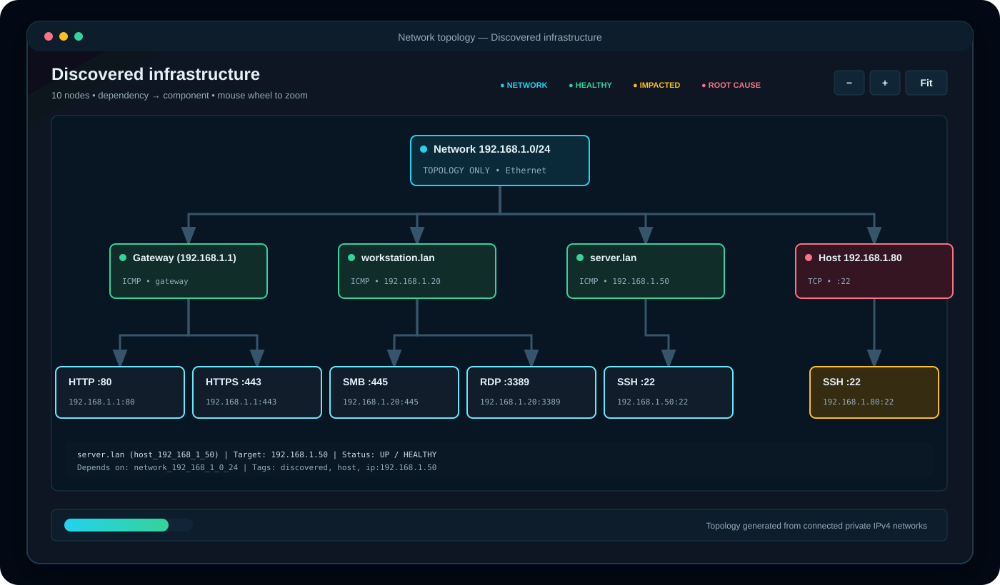
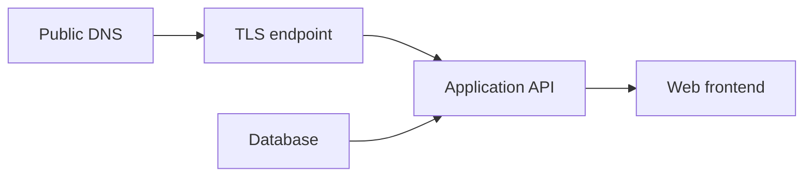

<p align="center">
  
</p>

<p align="center">
  <a href="https://github.com/FgSousace/Service-Dependency-Mapper/actions/workflows/tests.yml"></a>
  
  
  
  
  
  <a href="LICENSE"></a>
</p>

<p align="center">
  <strong>Automatyczne wykrywanie infrastruktury, interaktywna topologia i szybkie wskazywanie pierwotnej przyczyny awarii.</strong><br>
  Vendor-neutral • One-click discovery • Visual topology • Active health checks
</p>

<p align="center">
  <a href="#-szybki-start">Szybki start</a> •
  <a href="#%EF%B8%8F-graficzny-interfejs">GUI</a> •
  <a href="#-automatyczne-wykrywanie">Discovery</a> •
  <a href="#-automatyczne-aktualizacje">Aktualizacje</a> •
  <a href="#-adaptacyjna-wydajność">Wydajność</a> •
  <a href="#-jak-to-działa">Jak to działa</a> •
  <a href="#%EF%B8%8F-konfiguracja">Konfiguracja</a> •
  <a href="#-polecenia">Polecenia</a> •
  <a href="#-testy-i-jakość">Testy</a>
</p>

---

## O projekcie

W środowisku NOC jedna awaria często generuje wiele alertów. Niedostępny DNS
może spowodować błędy połączeń TCP i alarmy HTTP, chociaż rzeczywisty problem
jest tylko jeden.

**Service Dependency Mapper** automatycznie odkrywa prywatne sieci IPv4,
hosty i usługi TCP, buduje ich topologię, a następnie wykonuje aktywne testy
komponentów i rozdziela:

- **ROOT CAUSE** — prawdopodobne źródło awarii,
- **IMPACTED** — komponent dotknięty awarią zależności,
- **HEALTHY** — komponent oraz jego zależności działają poprawnie.

Narzędzie jest przeznaczone do diagnostyki i automatyzacji runbooków. Nie
zastępuje pełnego systemu monitoringu, ale pomaga ograniczyć szum alertowy i
szybciej rozpocząć właściwą eskalację.

> [!IMPORTANT]
> Projekt jest **niezależny od producenta i systemu monitoringu**. Discovery
> rozpoznaje ogólne protokoły i otwarte porty — nie wymaga konkretnego
> produktu, agenta, konta ani API.

## Najważniejsze funkcje

| Funkcja | Działanie |
|---|---|
| 🔎 One-click discovery | Automatyczne wykrywanie podłączonych sieci prywatnych, hostów i usług |
| 🗺️ Interaktywna topologia | Pełny widok `sieć → host → usługa`, zoom, przesuwanie i szczegóły węzłów |
| 🧭 Automatyczny inventory | IP, nazwa hosta, MAC, port, protokół, status HTTP i bezpiecznie odczytany banner |
| 🧩 Mapa zależności | Definiowanie dowolnych łańcuchów i rozgałęzień w YAML |
| 🖥️ Desktop GUI | Discovery, wybór mapy, wizualizacja, analiza i eksport bez wpisywania komend |
| 🔄 Bezpieczne aktualizacje | Automatyczne sprawdzanie wersji i aktualizacja z GUI po potwierdzeniu |
| ⚡ Adaptacyjna wydajność | Tryb Auto skaluje zadania sieciowe i analizę do wszystkich logicznych procesorów |
| 📡 Kontrole ICMP | Sprawdzanie osiągalności hostów przez systemowe polecenie ping |
| 🌐 Kontrole DNS | Rozwiązywanie nazw i opcjonalna weryfikacja oczekiwanych adresów |
| 🔌 Kontrole TCP | Sprawdzanie dostępności portu z limitem czasu |
| 🔐 Kontrole TLS | Weryfikacja handshake, certyfikatu, nazwy hosta i daty wygaśnięcia |
| ❤️ Kontrole HTTP | Weryfikacja statusu, przekierowania i oczekiwanej treści |
| 🎯 Analiza przyczyny | Oddzielanie awarii źródłowej od jej dalszych skutków |
| ⚡ Równoległe wykonanie | Jednoczesne sprawdzanie wielu komponentów |
| 📊 Raporty | Czytelna tabela terminalowa oraz stabilny schemat JSON |
| 🗺️ Eksport grafu | Mermaid i Graphviz DOT bez dodatkowych bibliotek |
| ✅ Walidacja | Brakujące zależności, duplikaty i cykle są wykrywane przed testami |
| 🤖 Automatyzacja | Jednoznaczne kody wyjścia dla CI, skryptów i runbooków |

## 🚀 Szybki start

### Wymagania

- Python **3.10 lub nowszy**
- Git
- Windows PowerShell
- Tkinter — dołączony do standardowej instalacji Pythona dla Windows

Każde polecenie uruchom jako osobny wiersz:

```powershell
Set-Location $HOME
git clone https://github.com/FgSousace/Service-Dependency-Mapper.git
Set-Location Service-Dependency-Mapper
python -m venv .venv
.\.venv\Scripts\Activate.ps1
python -m pip install -e .
```

Jeśli PowerShell zablokuje aktywację środowiska, zezwól na nią tylko w
bieżącym oknie:

```powershell
Set-ExecutionPolicy -Scope Process Bypass
.\.venv\Scripts\Activate.ps1
```

## 🖥️ Graficzny interfejs

Najprostszy sposób użycia:

```powershell
sdmap gui
```

Możesz również od razu wskazać dowolną mapę infrastruktury:

```powershell
sdmap gui examples\infrastructure-stack.yaml
```

Alternatywna komenda uruchamiająca dokładnie ten sam interfejs:

```powershell
sdmap-gui
```

GUI umożliwia:

- automatyczne sprawdzenie dostępności nowej wersji po uruchomieniu,
- bezpieczną instalację aktualizacji i restart aplikacji jednym przyciskiem,
- automatyczny dobór równoległości do procesora albo ręczny limit `1–256`,
- automatyczne wykrycie bieżącej infrastruktury jednym przyciskiem,
- anulowanie dłuższego skanowania bez zamrażania okna,
- otwarcie interaktywnej mapy całej wykrytej topologii,
- wybranie dowolnego pliku YAML,
- utworzenie nowego, neutralnego szablonu usługi,
- walidację grafu bez wykonywania połączeń,
- równoległe uruchomienie wszystkich kontroli,
- filtrowanie wzrokiem wyników `HEALTHY`, `IMPACTED` i `ROOT CAUSE`,
- podgląd komunikatu, zależności i surowych szczegółów komponentu,
- zmianę timeoutu i liczby workerów,
- eksport raportu JSON oraz grafu Mermaid lub Graphviz.

Discovery i analiza działają w osobnych wątkach, dlatego okno pozostaje
responsywne również podczas skanowania i oczekiwania na timeouty sieciowe.
Sprawdzanie oraz instalowanie aktualizacji również odbywa się w tle.

<p align="center">
  
</p>

## 🔄 Automatyczne aktualizacje

Po uruchomieniu GUI program w tle pobiera niewielki manifest wersji przez
HTTPS. Start aplikacji nie jest przez to blokowany, a brak internetu nie
powoduje błędu discovery ani analizy.

Jeżeli dostępna jest nowa wersja, przycisk **Check for updates** zmieni się na
**Update to v…**. Dla instalacji uruchamianej z klona repozytorium program po
potwierdzeniu:

1. sprawdzi, czy lokalny checkout jest na gałęzi `main` i nie ma własnych zmian,
2. wykona wyłącznie aktualizację typu fast-forward,
3. zaktualizuje pakiet w tym samym środowisku `.venv`,
4. zaproponuje ponowne uruchomienie GUI.

Updater nigdy nie nadpisuje lokalnych modyfikacji i nie instaluje aktualizacji
bez potwierdzenia użytkownika. Przycisk umożliwia też ręczne ponowienie
sprawdzenia wersji. W instalacji bez lokalnego checkoutu aktualizowany jest
pakiet z oficjalnego repozytorium w bieżącym środowisku Pythona.

## ⚡ Adaptacyjna wydajność

Pole **Parallelism** w GUI ma domyślną wartość `Auto`. Program odczytuje liczbę
logicznych procesorów dostępnych dla procesu i dobiera osobne limity dla
każdego rodzaju pracy:

| Etap | Automatyczna równoległość |
|---|---:|
| Wykrywanie TCP i skan portów | `16 × liczba logicznych CPU`, maks. 256 |
| ICMP | `4 × liczba logicznych CPU` |
| Reverse DNS | `2 × liczba logicznych CPU`, maks. 64 |
| Fingerprinting usług | `4 × liczba logicznych CPU`, maks. 96 |
| Analiza mapy | `4 × liczba logicznych CPU`, maks. 256 |

Przykładowo procesor z 16 wątkami logicznymi otrzyma do 256 równoległych prób
TCP, 64 zadania ICMP/fingerprintingu oraz 32 resolvery DNS. Zadania są
rozkładane przez system operacyjny na wszystkie dostępne procesory.

Discovery jest przede wszystkim operacją wejścia/wyjścia: większość czasu
oczekuje na odpowiedzi urządzeń lub timeouty. Dlatego niskie użycie CPU nie
oznacza, że program działa jednowątkowo. Sztuczne utrzymywanie 100% obciążenia
nie przyspieszyłoby sieci, a jedynie zwiększyłoby temperaturę i zużycie
energii.

W razie ograniczeń routera, firewalla lub systemu EDR można zamiast `Auto`
wpisać własną wartość od `1` do `256`.

## 🔎 Automatyczne wykrywanie

Nie musisz najpierw tworzyć pliku YAML. Uruchom GUI i kliknij
**Discover infrastructure**:

1. program odczyta aktywne prywatne interfejsy IPv4 w Windowsie lub Linuksie,
2. wykryje podłączone podsieci oraz dostępne bramy,
3. połączy wyniki ICMP, tablicy ARP/neighbor cache i bezpiecznych prób TCP,
4. sprawdzi porty TCP `1-1024` oraz zestaw często używanych portów wysokich,
5. wykona reverse DNS oraz ogólne rozpoznanie HTTP, TLS i bannerów tekstowych,
6. zapisze kompletny inventory jako nowy, timestampowany plik YAML,
7. zbuduje zależności `sieć → host → usługa`,
8. automatycznie otworzy interaktywną topologię.

Mapa jest zapisywana w:

```text
Documents\Service Dependency Mapper\maps\
```

W wizualizatorze można przybliżać mapę kółkiem myszy, przesuwać ją środkowym
przyciskiem, dopasować przyciskiem **Fit** i kliknąć dowolny węzeł, aby
zobaczyć jego IP, kontrolę, tagi i zależności.

<p align="center">
  
</p>

> [!NOTE]
> Discovery automatycznie ustala zależności techniczne pomiędzy siecią, hostem
> i otwartym portem. Zależności aplikacyjne, takie jak `frontend → API → baza`,
> nie zawsze są widoczne z warstwy sieciowej i mogą wymagać ręcznego
> doprecyzowania w wygenerowanym YAML.

## ⌨️ Tryb terminalowy

Automatycznie wykryj podłączoną infrastrukturę i utwórz mapę:

```powershell
sdmap discover --output moja-infrastruktura.yaml
```

Możesz również jawnie ograniczyć skan do prywatnej podsieci, którą
administrujesz:

```powershell
sdmap discover --network 192.168.1.0/24 --output moja-infrastruktura.yaml
```

Sprawdź poprawność przykładowej mapy:

```powershell
sdmap validate examples\healthy-demo.yaml
```

Uruchom kontrolowaną symulację awarii:

```powershell
sdmap check examples\outage-demo.yaml
```

## 🔍 Przykładowy wynik

```text
Service Dependency Mapper
Service: Simulated checkout outage
Overall: DOWN

COMPONENT     CHECK  TARGET                              RESULT  DIAGNOSIS
------------  -----  ----------------------------------  ------  ----------
Checkout DNS  DNS    checkout-does-not-exist.invalid     DOWN    ROOT CAUSE
Checkout TLS  TCP    checkout-does-not-exist.invalid:443 DOWN    IMPACTED
Checkout API  HTTP   https://checkout.../health          DOWN    IMPACTED

Root cause candidate(s): checkout_dns
```

Zamiast trzech niezależnych alarmów operator otrzymuje jednego kandydata na
przyczynę oraz listę usług, na które ta awaria wpływa.

## 🧠 Jak to działa?



1. Discovery może automatycznie utworzyć YAML z sieci, hostów i usług.
2. Plik YAML jest walidowany przed wykonaniem kontroli stanu.
3. Narzędzie odrzuca nieznane zależności, powtórzone identyfikatory i cykle.
4. Kontrole ICMP, DNS, TCP, TLS i HTTP są wykonywane współbieżnie.
5. Dla każdego błędu analizowane są wszystkie zależności nadrzędne.
6. Awaria bez niedziałającego upstreamu zostaje kandydatem na **ROOT CAUSE**.
7. Pozostałe elementy łańcucha otrzymują status **IMPACTED**.
8. Wynik trafia do tabeli, interaktywnej topologii, JSON lub eksportu grafu.

> [!NOTE]
> Określenie „root cause” oznacza najlepszego kandydata wynikającego z
> zadeklarowanego grafu i przeprowadzonych testów. Ostateczna diagnoza nadal
> należy do operatora.

## ⚙️ Konfiguracja

```yaml
version: 1

service:
  name: Customer portal
  description: Public frontend with API dependency

defaults:
  timeout: 3
  workers: auto

components:
  - id: public_dns
    name: Public DNS
    check:
      type: dns
      target: portal.example.com

  - id: frontend_tls
    name: Frontend TLS
    depends_on: [public_dns]
    check:
      type: tcp
      host: portal.example.com
      port: 443

  - id: frontend_http
    name: Frontend health
    depends_on: [frontend_tls]
    check:
      type: http
      url: https://portal.example.com/health
      expected_status: [200]
      contains: healthy
```

### Wspólne pola komponentu

| Pole | Wymagane | Opis |
|---|---:|---|
| `id` | tak | Stabilny identyfikator: małe litery, cyfry, `_` i `-` |
| `name` | nie | Czytelna nazwa; domyślnie wartość `id` |
| `depends_on` | nie | Lista komponentów wymaganych przez dany element |
| `critical` | nie | Czy awaria ma ustawić całą usługę jako `DOWN`; domyślnie `true` |
| `tags` | nie | Dowolne etykiety uwzględniane w raporcie JSON |
| `check.timeout` | nie | Limit czasu komponentu nadpisujący wartość domyślną |

### Obsługiwane kontrole

| Typ | Pola |
|---|---|
| `none` | Brak; logiczny węzeł używany wyłącznie do budowy topologii |
| `icmp` | `target`, opcjonalnie `count` |
| `dns` | `target`, opcjonalnie `expected_addresses` |
| `tcp` | `host`, `port` |
| `tls` | `host`, opcjonalnie `port`, `server_name`, `min_days_remaining` |
| `http` | `url`, `expected_status`, opcjonalnie `contains`, `method` |

## 💻 Polecenia

### Uruchomienie GUI

```powershell
sdmap gui
```

### Automatyczne wykrywanie infrastruktury

```powershell
sdmap discover --workers auto --output discovered-infrastructure.yaml
```

### Uruchomienie kontroli

```powershell
sdmap check examples\healthy-demo.yaml
```

### Raport JSON

```powershell
sdmap check examples\infrastructure-stack.yaml --format json --output reports\noc.json
```

### Nadpisanie czasu i współbieżności

```powershell
sdmap check service.yaml --timeout 5 --workers auto
```

### Walidacja bez połączeń sieciowych

```powershell
sdmap validate service.yaml
```

### Eksport grafu Mermaid

```powershell
sdmap graph service.yaml --format mermaid --output service-map.mmd
```

### Eksport Graphviz DOT

```powershell
sdmap graph service.yaml --format dot --output service-map.dot
```

### Kody wyjścia

| Kod | Znaczenie |
|---:|---|
| `0` | Wszystkie komponenty krytyczne są zdrowe |
| `1` | Usługa ma stan `DOWN` albo `DEGRADED` |
| `2` | Błędna konfiguracja lub problem wejścia/wyjścia |
| `130` | Przerwanie przez użytkownika |

## 🧪 Testy i jakość

Projekt ma **85 testów jednostkowych** obejmujących:

- dobór workerów do liczby logicznych CPU i limity poszczególnych etapów,
- sprawdzanie wersji, ochronę lokalnych zmian i przebieg aktualizacji,
- bezpieczne dekodowanie wyników poleceń na Windowsie niezależnie od strony kodowej,
- wykrywanie interfejsów i bezpieczne ograniczanie dużych podsieci,
- łączenie wyników ICMP, ARP i TCP,
- rozpoznawanie usług oraz generowanie kompletnego inventory YAML,
- deterministyczny układ interaktywnej topologii,
- walidację konfiguracji i typów kontroli,
- brakujące zależności, duplikaty i cykle,
- prawidłowy porządek zależności,
- wyniki ICMP, DNS, TCP, TLS i HTTP,
- parsowanie ustawień GUI i generowanie nowego szablonu,
- analizę root cause i propagację wpływu,
- niezależne awarie oraz komponenty niekrytyczne,
- raporty terminalowe i JSON,
- eksport Mermaid i Graphviz,
- interfejs CLI i kody błędów.

```powershell
python -m pip install -e ".[dev]"
ruff check .
python -m unittest discover -s tests -v
```

GitHub Actions wykonuje lint i testy na Windowsie oraz Ubuntu dla Pythona
3.10 i 3.12.

## 📁 Struktura

```text
Service-Dependency-Mapper/
├── .github/workflows/tests.yml
├── assets/banner.svg
├── assets/gui-preview.svg
├── assets/topology-preview.svg
├── examples/
│   ├── healthy-demo.yaml
│   ├── infrastructure-stack.yaml
│   └── outage-demo.yaml
├── src/service_dependency_mapper/
│   ├── analyzer.py
│   ├── checks.py
│   ├── cli.py
│   ├── config.py
│   ├── discovery.py
│   ├── graph.py
│   ├── gui.py
│   ├── models.py
│   ├── performance.py
│   ├── reporting.py
│   ├── topology.py
│   └── updater.py
├── tests/
├── CHANGELOG.md
├── update.json
├── LICENSE
├── pyproject.toml
└── README.md
```

## 🛡️ Bezpieczeństwo i ograniczenia

- Narzędzie wykonuje wyłącznie aktywne kontrole odczytowe.
- Automatyczne discovery skanuje wyłącznie zakresy prywatne IPv4 i CGNAT.
- Duże sieci są dzielone do maksymalnie 1022 hostów na wykrywany interfejs;
  informacja o ograniczeniu trafia do wygenerowanego inventory.
- Skanowane są porty TCP `1-1024` oraz ogólne porty wysokie; program nie
  wykonuje exploitów, logowania ani prób uwierzytelnienia.
- ICMP lub port blokowany przez firewall może spowodować, że host nie zostanie
  wykryty. Urządzenia bez adresu IP, ukryte kontenery i inne VLAN-y bez routingu
  nie są widoczne z samej warstwy sieciowej.
- Nie uruchamia komend z konfiguracji i nie zmienia monitorowanych systemów.
- W plikach YAML nie należy umieszczać haseł, tokenów ani innych sekretów.
- Testuj wyłącznie hosty i usługi, do których masz uprawniony dostęp.
- Kontrola DNS korzysta z resolvera systemowego; czas jej wykonania może
  zależeć od konfiguracji systemu operacyjnego.
- Kontrola ICMP korzysta z systemowego narzędzia `ping`, a nie z uprawnień do
  surowych gniazd.

## 🗺️ Roadmapa

- eksport metryk Prometheus,
- szablony runbooków dla typowych awarii,
- opcjonalne adaptery do standardowych źródeł inventory i telemetrii,
- historyczne porównywanie wyników,
- filtrowanie i wyszukiwanie w dużych mapach GUI.

## 📄 Licencja

Projekt jest dostępny na licencji [MIT](LICENSE).

---

<p align="center">
  Stworzone przez <a href="https://github.com/FgSousace">FgSousace</a>
</p>
